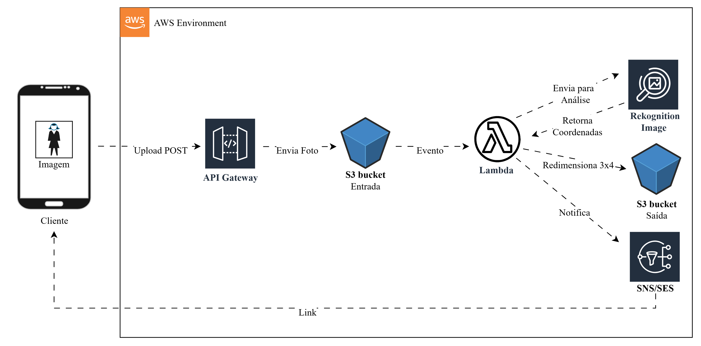

### 2º Desafio DIO – AWS Step Functions | AWS Cloud Foundations

---

## AWS Cloud Foundations – Serviços Serverless e Orquestração na AWS

A aula aborda conceitos essenciais de serviços serverless e de orquestração na AWS, com ênfase no uso do AWS Step Functions como ferramenta de automação e integração entre múltiplos serviços da nuvem.

## Tópicos Principais

### 1. Amazon ECS e Amazon EKS

**ECS (Elastic Container Service):** orquestrador de containers próprio da AWS.

**EKS (Elastic Kubernetes Service):** serviço baseado em Kubernetes, lançado após o ECS.

- Permite interface mais amigável.
- Compatível com ferramentas e padrões de mercado.
- Mais utilizado atualmente que o ECS.

### 2. Amazon SNS e Amazon SQS

**SNS (Simple Notification Service):** serviço de notificação e publicação de mensagens.
**SQS (Simple Queue Service):** sistema de filas de mensagens.

**Modos de operação:**

- **FIFO (First In, First Out):** mantém a ordem exata de entrega das mensagens.
- **Standard:** entrega assíncrona, sem garantia de ordem.

**Analogia com o carteiro:** FIFO entrega uma por vez, STANDARD segue entregando mesmo que uma falhe.

### 3. AWS Lambda

Serviço serverless para execução de pequenas funções sob demanda.
Suporte a diversas linguagens: Java, .NET, Node.js, entre outras.
Ideal para tarefas pequenas e escaláveis. Não indicado para grandes processamentos.

### 4. AWS Step Functions

Orquestrador visual de serviços e fluxos de trabalho (workflow).
Permite construir automações low-code, integrando Lambda, S3, DynamoDB, API Gateway etc.

**Recursos principais:**

- Criação de fluxos arrastando e conectando “caixas” (estados).
- Definição de condições lógicas (choices) e verificações (ex.: validar arquivo, checar variável).
- Execuções programadas (ex.: tarefas diárias às 7h).
- Integração com outros serviços (S3, EC2, DynamoDB, Bedrock).

**Exemplos práticos:**

- Automação para desligar máquinas EC2 às 18h e religá-las às 7h.
- Processamento de arquivos CSV em bucket S3 de forma recorrente.
- Geração de alertas via SNS com base em condições lógicas.

## Demonstração Prática

- Configuração e execução de workflow no Step Functions Studio.
- Uso do AWS CloudFormation para provisionar recursos automaticamente.
- Visualização e monitoramento no CloudWatch.
- Manipulação do fluxo via interface visual (adição, remoção e edição de estados).
- Exportação de workflows em JSON ou YAML.

## Análise Crítica

**Pontos fortes:**

- Automação sem necessidade de codificação extensa.
- Integração nativa com múltiplos serviços da AWS.
- Ideal para fluxos de negócio e validações recorrentes.

**Limitações:**

- Execução dependente de permissões e recursos pré-configurados.
- Curva de aprendizado inicial para compreender a lógica de estados.

## Conclusões

O Step Functions representa a evolução da automação na AWS, permitindo criar pipelines e rotinas complexas sem grande esforço de programação.
Em conjunto com Lambda, SNS, SQS, EKS e ECS, forma um ecossistema completo para arquiteturas modernas e escaláveis.

## Referência
AWS Step Functions - https://aws.amazon.com/pt/step-functions/

---
