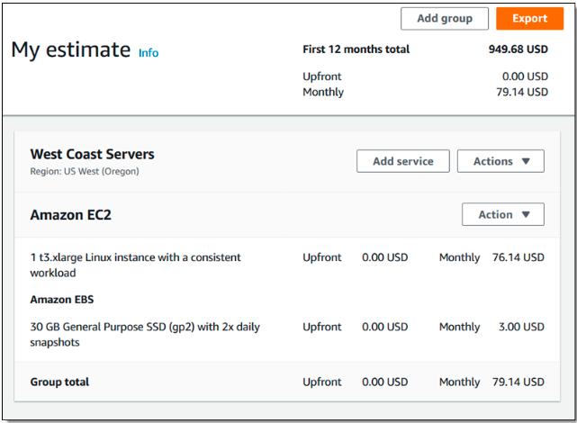
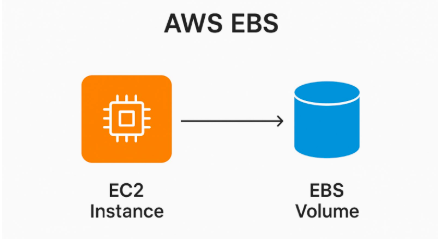
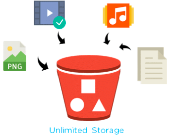
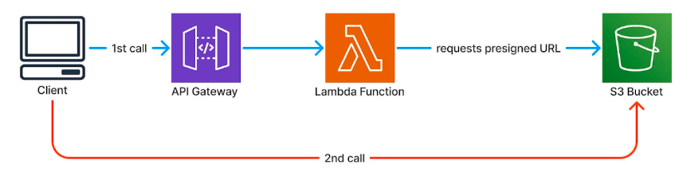
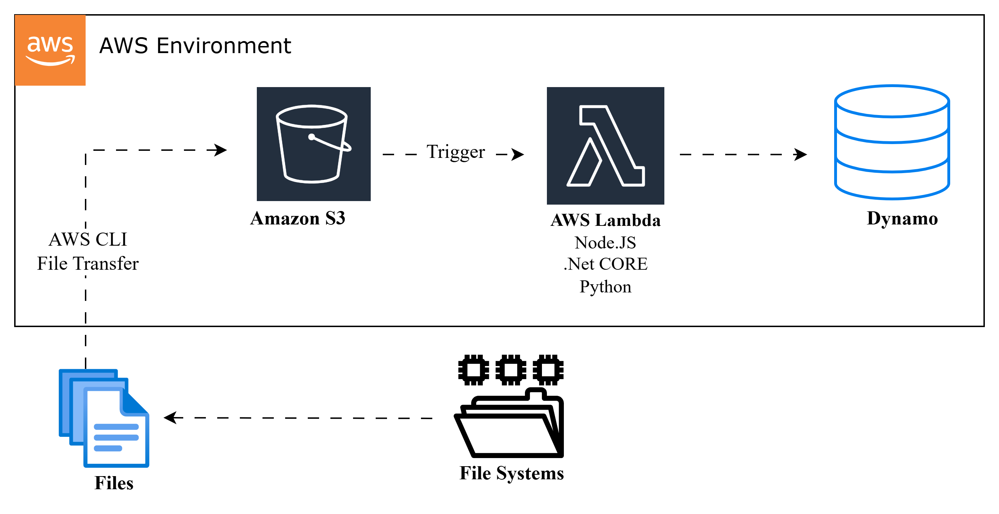
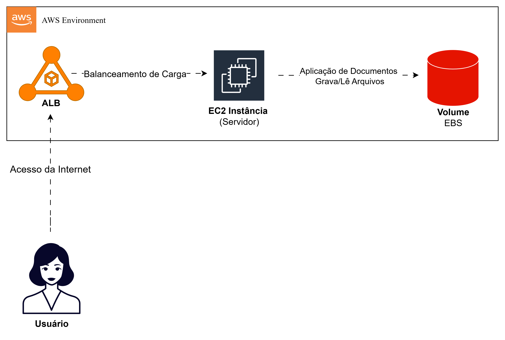

### Code girls -AWS

---

## MÓDULO 2: Computação na Nuvem com EC2

---

### 1. Entendendo as Instâncias EC2 e a Otimização de Recursos na AWS

EC2 é o serviço de computação da AWS. Se você precisa de um computador na nuvem, você usa EC2. Simples assim. Mas o desafio real é escolher o tipo certo de computador e não gastar uma fortuna mantendo máquinas que não está usando.

---

### Sumário

- Amazon EC2
- Criando uma Instância EC2
- Otimização: O Grande Desafio
- Modelos de Precificação do EC2
- Amazon EBS
- Amazon S3
- Classes de armazenamento do S3
- Gerenciamento de arquivos (EC2 + EBS)
- Gerenciamento de arquivos (S3 + Lambda)
- 1 - Diagrama: Repositório de Documentos do Bootcamp (EC2 + EBS)
- 2 - Diagrama: Foto 3x4 Serverless (S3 + Lambda)
- Conclusão
- Referências

---

### Amazon EC2

Instâncias EC2 são máquinas virtuais na AWS, que podem rodar Windows ou Linux, e seguem o
modelo IaaS, a gente gerencia a infraestrutura como serviço, cuidando dos apps, dados e conexões,
enquanto a AWS cuida do resto. Cada uma tem CPU, memória, disco, rede e SO. Para escolher a
ideal para uma aplicação, o foco é na eficiência, escalabilidade e economia, entendendo bem o que
o app precisa para não desperdiçar recursos.

  

---

### Criando uma Instância EC2

Quando você cria uma instância, você precisa escolher:

1. **AMI (Amazon Machine Image)**
   É a "receita" da máquina. Tipo um molde.

  

**Exemplos de AMIs:**

- Ubuntu 20.04
- Windows Server 2022
- Amazon Linux
- Imagens customizadas

Você escolhe qual sistema operacional quer rodar.

2. **Tipo de Instância**
   Escolher o "tamanho" da máquina.

  

**Exemplos:**

- t2.micro = pequeno (1 processador, 1GB RAM) - barato
- t2.small = pequeno-médio (1 processador, 2GB RAM)
- m5.large = médio (2 processadores, 8GB RAM)
- c5.xlarge = grande para processamento (4 processadores, 8GB RAM)

Quanto maior, mais caro.

3. **Security Group**
   É o firewall da máquina. Você escolhe quem pode acessar.

**Exemplo:**

- "Porta 80 (HTTP) aberto para o mundo" (qualquer um acessa)
- "Porta 22 (SSH) aberto só para meu IP" (só eu entro de forma segura)
- "Porta 443 (HTTPS) aberto para o mundo"
- "Banco de dados na porta 3306 fechado" (ninguém acessa de fora)

---

### Otimização: O Grande Desafio

Otimizar = gastar menos mantendo a mesma performance (ou melhorando!).O problema real: Muitas empresas criam servidores para um projeto, o projeto termina, mas o
servidor continua rodando. E pagando. E pagando. E pagando...Resultado: conta gigante no fim do mês.

1. **Desliga máquinas não usadas**

- Servidor de teste que só usa de segunda a sexta?
  - Desliga toda sexta à noite
  - Liga toda segunda de manhã
- Servidor de desenvolvimento parado no fim de semana?
  - Desliga

Menos horas rodando = menos dinheiro

2. **Elimina recursos ociosos**
   Tipo alugar uma van de 50 lugares para levar 2 pessoas. Desperdício!
   Se você tem 10 servidores mas só usa 3, apaga os 7 que não usa.
3. **Escala inteligente**
   Existem dois tipos:

**Escalabilidade Vertical:**

- Aumentar recursos na mesma máquina
- Exemplo: passar de 2GB RAM para 8GB RAM
- Mais poder no mesmo servidor

**Escalabilidade Horizontal:**

- Adicionar mais máquinas
- Exemplo: passar de 1 servidor para 5 servidores
- Distribuir carga entre vários

---

### Modelos de Precificação do EC2

  

#### On-Demand (Sob Demanda)

Pague apenas pelas horas utilizadas, sem compromissos.

**Quando usar:** Workloads imprevisíveis, testes, projetos novos, aplicações que rodam
esporadicamente.
**Vantagens:** Flexibilidade total, sem compromisso.
**Desvantagens:** Custo por hora mais alto.

#### Reserved Instances (Reservadas)

Comprometa-se por 1 ou 3 anos e ganhe até 60% de desconto.

**Quando usar:** Aplicações rodando 24/7, produção estável, demanda previsível.
**Vantagens:** Economia substancial.
**Desvantagens:** Pagamento antecipado obrigatório, perda do investimento se não usar.

#### Spot Instances (Spot)

Aproveite capacidade ociosa com até 90% de desconto, mas a AWS pode interromper com 2
minutos de aviso.

**Quando usar:** Processamento batch, análise de dados, tarefas tolerantes a interrupções.
**Vantagens:** Custo extremamente baixo.
**Desvantagens:** Pode ser interrompido pela AWS a qualquer momento.

---

### Elastic IP

Instâncias EC2 recebem IPs públicos que mudam a cada reinicialização.
Elastic IP é um endereço fixo que você pode associar à sua instância, mantendo o mesmo IP
independente de paradas ou reinicializações.

---

### Otimização de Custos

Instâncias não precisam rodar 24/7. Você pode desligá-las quando não estiver usando, programar
horários automáticos, ou usar Auto Scaling para ajustar capacidade dinamicamente.

  

---

## 2. Armazenamento na Nuvem com Amazon EBS e S3

### Amazon EBS: O "HD Externo" da Nuvem

  

EBS (Elastic Block Store) funciona como um disco rígido que você conecta à sua instância EC2,
oferecendo armazenamento em bloco persistente e configurável.

Recursos principais: Você pode redimensionar o volume em tempo real, criar snapshots para
backup, ativar criptografia e anexar múltiplos volumes à mesma instância.

Tipos disponíveis: Os volumes gp2/gp3 atendem aplicações gerais, enquanto io1/io2 são
otimizados para cargas de trabalho que exigem altíssima performance e IOPS.

Limitações: Um volume EBS está vinculado a uma única instância e zona de disponibilidade. Se a
instância falhar, o acesso ao volume fica temporariamente indisponível até que seja reanexado.

Persistência: Os dados permanecem no volume mesmo após desligar a instância, diferente do
armazenamento efêmero (instance store). Porém, falhas no volume sem snapshots podem resultar
em perda de dados.

  

---

### Amazon S3: O Armazém Infinito

  

S3 (Simple Storage Service) é o serviço de armazenamento de objetos da AWS para guardar
qualquer tipo de arquivo - fotos, vídeos, documentos, backups, logs - com capacidade praticamente
ilimitada.

   
  

Como funciona: Você organiza arquivos em buckets (containers) e pode acessá-los de qualquer
lugar via HTTP/HTTPS. Cada objeto pode ter até 5TB de tamanho.

Durabilidade e disponibilidade: Projetado para 99.999999999% (11 noves) de durabilidade,
replicando automaticamente seus dados entre múltiplas zonas de disponibilidade.

Flexibilidade: Oferece diferentes classes de armazenamento para otimizar custos conforme a
frequência de acesso, desde dados "quentes" (acesso frequente) até arquivamento de longo prazo.

Casos de uso: Hospedagem de sites estáticos, data lakes, backup e disaster recovery,
armazenamento de mídia, distribuição de conteúdo.

Diferenças:

------------------------------------

### Classes de Armazenamento do S3

  

O S3 oferece diferentes classes de armazenamento, cada uma otimizada para padrões específicos
de acesso e com preços variados conforme a frequência de uso dos seus dados.

**Standard**
Classe padrão para dados acessados frequentemente, com disponibilidade imediata e sem taxas de
recuperação.

**Standard-IA (Infrequent Access)**
Destinada a dados raramente acessados, oferece armazenamento mais barato que o Standard, mas
cobra uma taxa sempre que você recupera os dados.

**One Zone-IA**
Similar ao Standard-IA, porém armazena os dados em somente uma zona de disponibilidade ao
invés de múltiplas, reduzindo custos, mas aumentando o risco de perda em caso de falha na zona.

**Glacier**
Projetada para arquivamento de longo prazo com custo muito baixo de armazenamento, mas o
tempo de recuperação dos dados é medido em horas.

**Deep Archive**
A opção mais econômica para retenção de dados de longuíssimo prazo que raramente (ou nunca)
precisam ser acessados, com tempo de recuperação ainda maior que o Glacier.

**Lifecycle**
Regras automáticas que você configura para transicionar objetos entre classes de armazenamento
ou deletá-los após períodos específicos, eliminando a necessidade de gerenciamento manual e
otimizando custos conforme o ciclo de vida dos seus dados.

  

---

## Gerenciando Instâncias EC2 na AWS

### Gerenciamento de arquivos (EC2 + EBS)

Montar um servidor com 2 EBS:

1. Um processa os arquivos
2. Outro deixa disponível pra acessar

**Como funciona:**
O usuário entra no sistema e manda o arquivo pra nuvem (EBS). O EC2 pega esse arquivo, processa, valida,
consulta no banco... Depois o EBS fica com os documentos disponíveis para quando precisar acessar.

  

---

### Gerenciamento de arquivos (S3 + Lambda)

**Como funciona:**
O sistema de arquivos manda o arquivo para o S3 usando linha de comando ou transfer file. Depois o
Lambda pega esse arquivo, processa e joga no banco de dados.

  

---

### Desafio drawio

#### 1 - Diagrama: Repositório de Documentos do Bootcamp (EC2 + EBS)

O EC2 permite controle total sobre máquinas virtuais e o EBS é tipo um HD virtual. Foi daí que veio
a ideia, claro que o uso dos dois é para grande escala, mas pensei numa arquitetura onde o sistema
gerencia os documentos de estudo do bootcamp e guarda esses dados.

**Como funciona:**

1. Usuário/Aluno - A pessoa acessa o sistema pela internet para enviar ou consultar
   documentos de estudo
2. ALB (Application Load Balancer) - Recebe as requisições e distribui o tráfego entre as
   instâncias EC2 disponíveis
3. Auto Scaling Group - Gerencia a infraestrutura das instâncias EC2, controlando quantas
   estão ativas e saudáveis
4. Instância EC2 - É o "coração" da aplicação, executa o sistema que:
   ○ Recebe a requisição do ALB
   ○ Processa os documentos (upload, validação, organização)
   ○ Acessa o volume EBS para gravar novos arquivos
   ○ Lê arquivos já armazenados quando o usuário solicita
   ○ Retorna a resposta para o usuário
5. Amazon EBS - Funciona como HD virtual permanente, armazenando todos os documentos
   de estudo do bootcamp de forma persistente

  

---

#### 2 - Diagrama: Foto 3x4 Serverless (S3 + Lambda)

O Lambda é conhecido popularmente pelo processamento de imagens. Então estive pensando: recentemente
tirei meu documento de identificação e me veio a ideia e se tivéssemos um sistema que redimensiona
automaticamente a imagem para o formato 3x4? Foi assim que surgiu a ideia para esse diagrama.

**Como funciona:**

1. Cliente - A pessoa envia a foto via POST através da API
2. API Gateway - Recebe a requisição e funciona como porta de entrada
3. S3 Entrada - Armazena a foto original enviada
4. Lambda - É o "coração" da aplicação, orquestra todo o processo:
   ○ Pega a foto do S3 Entrada
   ○ Envia para o Rekognition analisar o rosto
   ○ Recebe as coordenadas do rosto
   ○ Redimensiona e corta a foto para o formato 3x4 (padrão de documento)
   ○ Salva no S3 Saída
   ○ Envia notificação via SNS
5. Rekognition - Usa IA para detectar o rosto e fornecer as coordenadas
6. S3 Saída - Armazena a foto final em formato 3x4
7. SNS/SES - Envia email/SMS para o cliente com um link para baixar a foto processada

---

### Conclusão

- EC2 é poderoso mas exige disciplina. Escolha a instância certa, monitore seus custos, desliga o que não usa. O maior vilão de contas altas na AWS é "máquina esquecida rodando por meses".
- EBS é seu HD externo rápido. S3 é seu armazém infinito. Use EBS para dados que precisa de acesso rápido (bancos de dados, sistema operacional). Use S3 para arquivos e backups, aproveitando as classes de armazenamento para economizar.
- As arquiteturas AWS com EC2/EBS e S3/Lambda oferecem escalabilidade, automação e eficiência para gerenciamento de arquivos, ideais para processamento persistente ou serverless em escala.

---

### Referências

- AWS EC2 Pricing: https://aws.amazon.com/ec2/pricing/
- AWS EC2 Documentation: https://docs.aws.amazon.com/ec2/
- AWS EBS: https://aws.amazon.com/ebs/
- AWS S3: https://aws.amazon.com/s3/
- S3 Storage Classes: https://aws.amazon.com/s3/storage-classes/
- Amazon EC2: https://docs.aws.amazon.com/AWSEC2/latest/UserGuide/concepts.html
- Amazon EBS: https://docs.aws.amazon.com/AWSEC2/latest/UserGuide/AmazonEBS.html
- Amazon S3: https://docs.aws.amazon.com/AmazonS3/latest/userguide/Welcome.html
- AWS Lambda: https://docs.aws.amazon.com/lambda/latest/dg/welcome.html

Documento: [DESAFIO.pdf](../materiais-de-apoio/DESAFIO.pdf)
