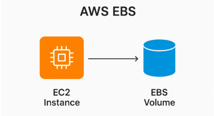
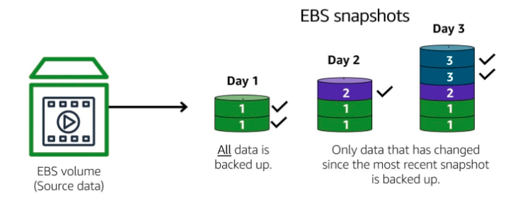
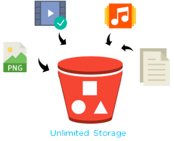
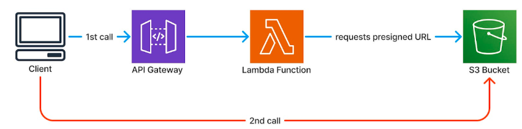
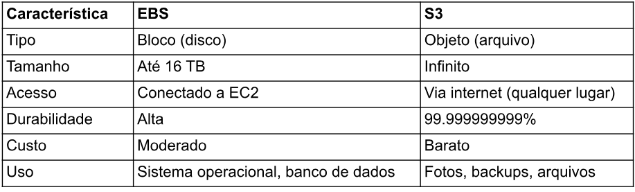
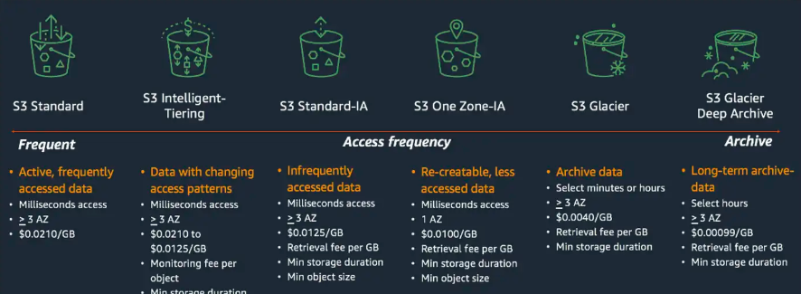
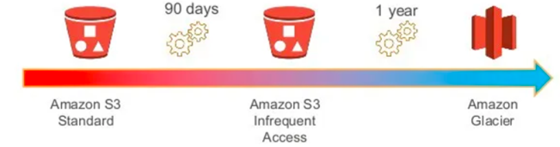

### Code girls -AWS

---

## 2. Armazenamento na Nuvem com Amazon EBS e S3

Você tem um computador (EC2), mas onde guarda os dados? AWS oferece 2 soluções: EBS para
armazenamento rápido anexado à máquina, e S3 para armazenamento massivo de qualquer coisa.
Cada um é bom para um uso diferente.

---

### Amazon EBS: O "HD Externo" da Nuvem

  

EBS (Elastic Block Store) funciona como um disco rígido que você conecta à sua instância EC2,
oferecendo armazenamento em bloco persistente e configurável.

Recursos principais: Você pode redimensionar o volume em tempo real, criar snapshots para
backup, ativar criptografia e anexar múltiplos volumes à mesma instância.

Tipos disponíveis: Os volumes gp2/gp3 atendem aplicações gerais, enquanto io1/io2 são
otimizados para cargas de trabalho que exigem altíssima performance e IOPS.

Limitações: Um volume EBS está vinculado a uma única instância e zona de disponibilidade. Se a
instância falhar, o acesso ao volume fica temporariamente indisponível até que seja reanexado.

Persistência: Os dados permanecem no volume mesmo após desligar a instância, diferente do
armazenamento efêmero (instance store). Porém, falhas no volume sem snapshots podem resultar
em perda de dados.

  

---

### Amazon S3: O Armazém Infinito

  

S3 (Simple Storage Service) é o serviço de armazenamento de objetos da AWS para guardar
qualquer tipo de arquivo - fotos, vídeos, documentos, backups, logs - com capacidade praticamente
ilimitada.

  

Como funciona: Você organiza arquivos em buckets (containers) e pode acessá-los de qualquer
lugar via HTTP/HTTPS. Cada objeto pode ter até 5TB de tamanho.

Durabilidade e disponibilidade: Projetado para 99.999999999% (11 noves) de durabilidade,
replicando automaticamente seus dados entre múltiplas zonas de disponibilidade.

Flexibilidade: Oferece diferentes classes de armazenamento para otimizar custos conforme a
frequência de acesso, desde dados "quentes" (acesso frequente) até arquivamento de longo prazo.

Casos de uso: Hospedagem de sites estáticos, data lakes, backup e disaster recovery,
armazenamento de mídia, distribuição de conteúdo.

Diferenças:

------------------------------------

### Classes de Armazenamento do S3

  

O S3 oferece diferentes classes de armazenamento, cada uma otimizada para padrões específicos
de acesso e com preços variados conforme a frequência de uso dos seus dados.

**Standard**
Classe padrão para dados acessados frequentemente, com disponibilidade imediata e sem taxas de
recuperação.

**Standard-IA (Infrequent Access)**
Destinada a dados raramente acessados, oferece armazenamento mais barato que o Standard, mas
cobra uma taxa sempre que você recupera os dados.

**One Zone-IA**
Similar ao Standard-IA, porém armazena os dados em somente uma zona de disponibilidade ao
invés de múltiplas, reduzindo custos, mas aumentando o risco de perda em caso de falha na zona.

**Glacier**
Projetada para arquivamento de longo prazo com custo muito baixo de armazenamento, mas o
tempo de recuperação dos dados é medido em horas.

**Deep Archive**
A opção mais econômica para retenção de dados de longuíssimo prazo que raramente (ou nunca)
precisam ser acessados, com tempo de recuperação ainda maior que o Glacier.

**Lifecycle**
Regras automáticas que você configura para transicionar objetos entre classes de armazenamento
ou deletá-los após períodos específicos, eliminando a necessidade de gerenciamento manual e
otimizando custos conforme o ciclo de vida dos seus dados.

  

---

### Conclusão

EBS é seu HD externo rápido. S3 é seu armazém infinito. Use EBS para dados que precisa de
acesso rápido (bancos de dados, sistema operacional). Use S3 para arquivos e backups,
aproveitando as classes de armazenamento para economizar.

---

### Referências

- AWS EBS: [https://aws.amazon.com/ebs/](https://aws.amazon.com/ebs/)
- AWS S3: [https://aws.amazon.com/s3/](https://aws.amazon.com/s3/)
- S3 Storage Classes: [https://aws.amazon.com/s3/storage-classes/](https://aws.amazon.com/s3/storage-classes/)

---
