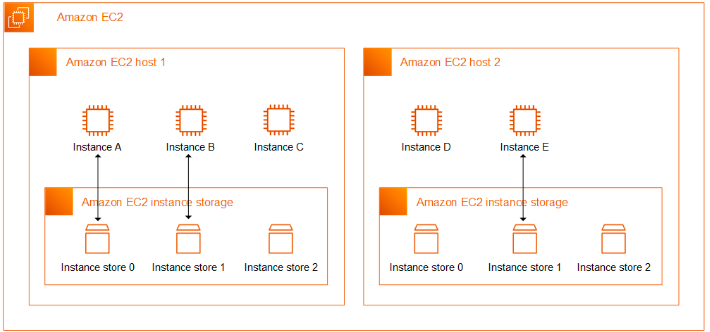
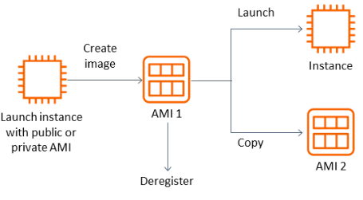
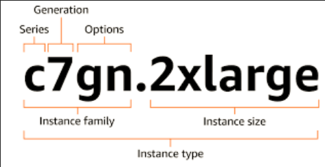
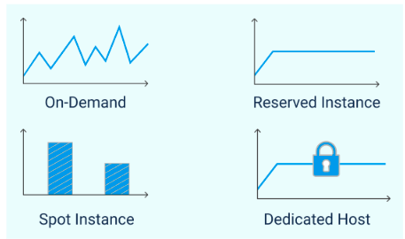
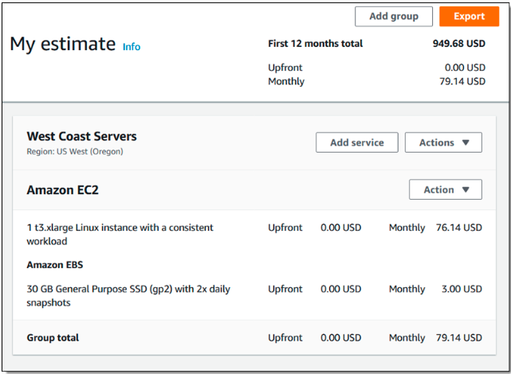

### Code girls -AWS

---

## MÓDULO 2: Computação na Nuvem com EC2

---

EC2 é o serviço de computação da AWS. Se você precisa de um computador na nuvem, você usa
EC2. Simples assim. Mas o desafio real é escolher o tipo certo de computador e não gastar uma
fortuna mantendo máquinas que não está usando.

---

### Amazon EC2

Instâncias EC2 são máquinas virtuais na AWS, que podem rodar Windows ou Linux, e seguem o
modelo IaaS, a gente gerencia a infraestrutura como serviço, cuidando dos apps, dados e conexões,
enquanto a AWS cuida do resto. Cada uma tem CPU, memória, disco, rede e SO. Para escolher a
ideal para uma aplicação, o foco é na eficiência, escalabilidade e economia, entendendo bem o que
o app precisa para não desperdiçar recursos.

  

---

### Criando uma Instância EC2

Quando você cria uma instância, você precisa escolher:

1. **AMI (Amazon Machine Image)**
   É a "receita" da máquina. Tipo um molde.

  

**Exemplos de AMIs:**

- Ubuntu 20.04
- Windows Server 2022
- Amazon Linux
- Imagens customizadas

Você escolhe qual sistema operacional quer rodar.

2. **Tipo de Instância**
   Escolher o "tamanho" da máquina.

  

**Exemplos:**

- t2.micro = pequeno (1 processador, 1GB RAM) - barato
- t2.small = pequeno-médio (1 processador, 2GB RAM)
- m5.large = médio (2 processadores, 8GB RAM)
- c5.xlarge = grande para processamento (4 processadores, 8GB RAM)

Quanto maior, mais caro.

3. **Security Group**
   É o firewall da máquina. Você escolhe quem pode acessar.

**Exemplo:**

- "Porta 80 (HTTP) aberto para o mundo" (qualquer um acessa)
- "Porta 22 (SSH) aberto só para meu IP" (só eu entro de forma segura)
- "Porta 443 (HTTPS) aberto para o mundo"
- "Banco de dados na porta 3306 fechado" (ninguém acessa de fora)

---

### Otimização: O Grande Desafio

Otimizar = gastar menos mantendo a mesma performance (ou melhorando!).O problema real: Muitas empresas criam servidores para um projeto, o projeto termina, mas o
servidor continua rodando. E pagando. E pagando. E pagando...Resultado: conta gigante no fim do mês.

1. **Desliga máquinas não usadas**

- Servidor de teste que só usa de segunda a sexta?
  - Desliga toda sexta à noite
  - Liga toda segunda de manhã
- Servidor de desenvolvimento parado no fim de semana?
  - Desliga

Menos horas rodando = menos dinheiro

2. **Elimina recursos ociosos**
   Tipo alugar uma van de 50 lugares para levar 2 pessoas. Desperdício!
   Se você tem 10 servidores mas só usa 3, apaga os 7 que não usa.
3. **Escala inteligente**
   Existem dois tipos:

**Escalabilidade Vertical:**

- Aumentar recursos na mesma máquina
- Exemplo: passar de 2GB RAM para 8GB RAM
- Mais poder no mesmo servidor

**Escalabilidade Horizontal:**

- Adicionar mais máquinas
- Exemplo: passar de 1 servidor para 5 servidores
- Distribuir carga entre vários

---

### Modelos de Precificação do EC2

  

#### On-Demand (Sob Demanda)

Pague apenas pelas horas utilizadas, sem compromissos.

**Quando usar:** Workloads imprevisíveis, testes, projetos novos, aplicações que rodam
esporadicamente.
**Vantagens:** Flexibilidade total, sem compromisso.
**Desvantagens:** Custo por hora mais alto.

#### Reserved Instances (Reservadas)

Comprometa-se por 1 ou 3 anos e ganhe até 60% de desconto.

**Quando usar:** Aplicações rodando 24/7, produção estável, demanda previsível.
**Vantagens:** Economia substancial.
**Desvantagens:** Pagamento antecipado obrigatório, perda do investimento se não usar.

#### Spot Instances (Spot)

Aproveite capacidade ociosa com até 90% de desconto, mas a AWS pode interromper com 2
minutos de aviso.

**Quando usar:** Processamento batch, análise de dados, tarefas tolerantes a interrupções.
**Vantagens:** Custo extremamente baixo.
**Desvantagens:** Pode ser interrompido pela AWS a qualquer momento.

---

### Elastic IP

Instâncias EC2 recebem IPs públicos que mudam a cada reinicialização.
Elastic IP é um endereço fixo que você pode associar à sua instância, mantendo o mesmo IP
independente de paradas ou reinicializações.

---

### Otimização de Custos

Instâncias não precisam rodar 24/7. Você pode desligá-las quando não estiver usando, programar
horários automáticos, ou usar Auto Scaling para ajustar capacidade dinamicamente.

  

---

### Conclusão

EC2 é poderoso mas exige disciplina. Escolha a instância certa, monitore seus custos, desliga o que
não usa. O maior vilão de contas altas na AWS é "máquina esquecida rodando por meses".

---

### Referências

- AWS EC2 Pricing: [https://aws.amazon.com/ec2/pricing/](https://aws.amazon.com/ec2/pricing/)
- AWS EC2 Documentation: [https://docs.aws.amazon.com/ec2/](https://docs.aws.amazon.com/ec2/)

---
