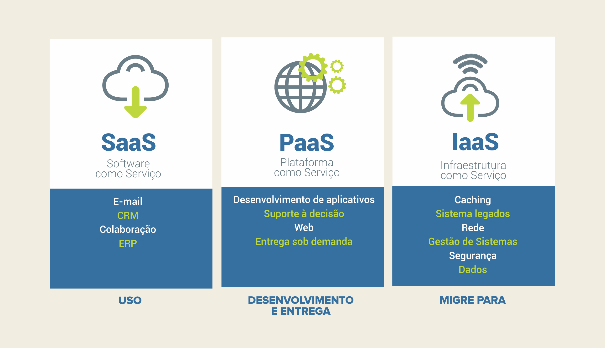
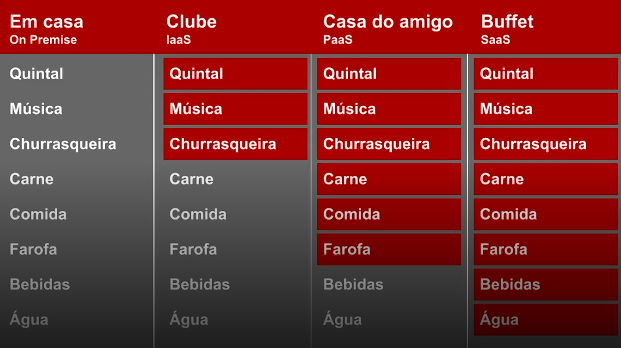

### Code girls - AWS

---

# MÓDULO 1: Introdução à AWS e Conceitos Básicos

---

## 1. Introdução à AWS e ao Universo da Computação em Nuvem

A computação em nuvem revolucionou a forma como as empresas usam tecnologia. Em vez
de comprar computadores caros e guardar em data centers próprios, você aluga recursos da
internet quando precisa. A AWS é a maior provedora de computação em nuvem do mundo.

---

## História da Amazon

A Amazon foi fundada pelo Jeff Bezos, estava na moda a criação de sites pela internet e então ele teve uma grande ideia, uma <ins>livraria online!</ins>
Logo, iniciou o projeto de livraria online em 1994. O escritório era em sua garagem, localizada em Seattle, Washington. O site foi lançado oficialmente em 1995!

  

    A loja de tudo: Jeff Bezos e a era da Amazon

### 🔹 Curiosidades!

> - O nome inicial da Amazon foi Cadabra. Fazendo uma associação com abracadabra por ter uma magia nos livros!
> - O nome da Amazon foi inspirado no Rio Amazonas, sim esse mesmo. Um dos maiores rios do mundo em extensão e cuja grande parte fica localizada no Brasil! No início, esse nome não pegou muito, os gringos não conheciam muito sobre a nossa cultura, mas o Jeff usou o marketing "Esse rio supera todos os outros de longe" dando a entender que ele superaria tudo e todos!

---

## História da AWS

A Amazon começou desenvolvendo soluções de tecnologia para gerenciar seus próprios recursos de computação durante os anos 2000. Percebendo que essas ferramentas internas poderiam ser úteis para outras empresas, a companhia decidiu transformar essa expertise em um serviço comercial. Em 2006, lançou oficialmente a AWS com serviços como o S3 para armazenamento de dados e o EC2 para processamento, criando assim uma plataforma completa de computação em nuvem. O grande diferencial foi o modelo de pagamento por uso, onde os clientes só desembolsam pelo que realmente consomem, o que representou uma inovação importante no mercado da época.

---

### Os 3 Modelos de Serviço em Nuvem

Existem 3 formas diferentes de usar nuvem. Cada uma tem um nível de responsabilidade
diferente:

    

#### **IaaS - Infrastructure as a Service (Infraestrutura como Serviço)**

Você aluga os computadores. Você cuida do resto.

- O que a AWS cuida: Máquinas físicas, energia, rede básica
- O que **você** cuida: Sistema operacional, aplicativos, dados, segurança de aplicação

**Exemplo real:** Instâncias EC2 (um computador virtual que você aluga)
**Analogia:** É como alugar um terreno vazio. Você constrói o que quer em cima dele.

---

#### **PaaS - Platform as a Service (Plataforma como Serviço)**

Você coloca seu código. A AWS cuida de quase tudo.

- O que a AWS cuida: Infraestrutura + Sistema Operacional + Banco de Dados
- O que **você** cuida: Seu código/aplicação

**Exemplo real:** SQL Server pronto para usar na AWS.
**Analogia:** É como alugar um apartamento mobiliado. Você só traz suas coisas e mora.

---

#### **SaaS - Software as a Service (Software como Serviço)**

Pronto para usar. Sem instalar nada.

- O que a AWS cuida: Absolutely everything!
- O que **você** cuida: Nada! Só usar e pagar

**Exemplos:** Gmail, Netflix, Spotify, sistemas de CRM
**Analogia:** É como ir para um hotel. Tudo está pronto, você só aproveita.

---

### A Analogia do Churrasco

Imagine que você quer fazer um churrasco

    

|              Modelo              |                                 Responsabilidade                                 |
| :-------------------------------: | :-------------------------------------------------------------------------------: |
| **On Premise (servidor em casa)** | Você cuida de tudo: compra o terreno, a churrasqueira, a carne, prepara e limpa |
|             **IaaS**             |     A AWS oferece o terreno e a churrasqueira. Você compra a carne e prepara     |
|             **PaaS**             | A AWS oferece terreno, churrasqueira**e** a carne já comprada. Você só prepara |
|             **SaaS**             |            A AWS oferece o churrasco**pronto**. Você só come e paga            |

---

### Por que a AWS é a Preferida?

A AWS não apenas oferece infraestrutura, ela inova constantemente.

> Comentário do professor: “Todas as clouds estão atentas ao mercado, mas a AWS sempre está um passo à frente.”

**3 Formas de Crescer com AWS:**

1. Aumentar recursos: sua empresa cresceu? Expanda seus servidores na nuvem
2. Migrar aplicativos: traga sistemas antigos para a nuvem
3. Criar novos negócios: desenvolva aplicativos inovadores direto na AWS

**Meu comentário:**
Apesar de haver outras clouds (Google Cloud, Azure), a AWS é preferida porque tem sempre soluções novas conforme o mercado evolui.

---

### Conclusão

A AWS começou como uma solução interna da Amazon e se transformou na maior provedora
de nuvem do mundo. Entender sua história ajuda a entender por que ela é tão poderosa.

---

### Referências

- Referência geral da AWS - https://docs.aws.amazon.com/general/latest/gr/Welcome.html
- Cotas de serviço da AWS - https://docs.aws.amazon.com/general/latest/gr/aws_service_limits.html

---
