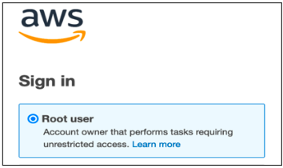
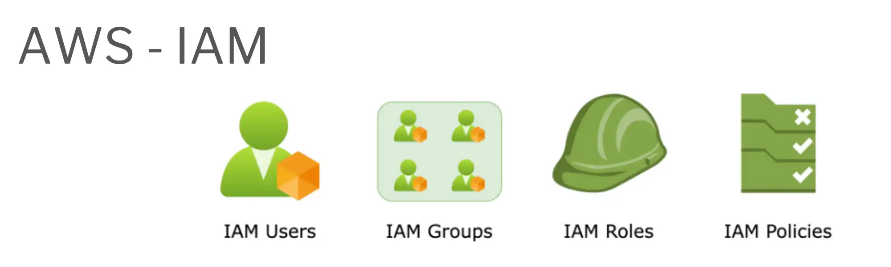
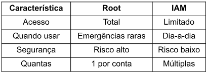
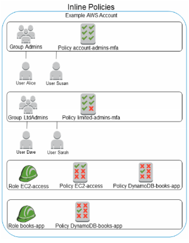
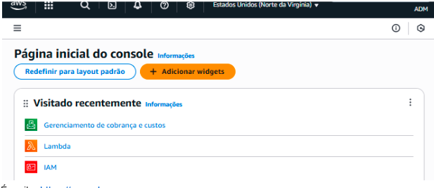
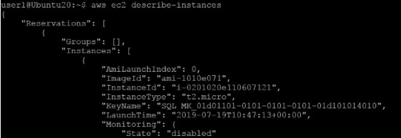
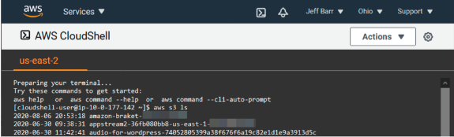

### Code girls - AWS

---

## 3. Configurando sua Conta AWS com Segurança e Eficiência

Criar uma conta AWS é fácil. O difícil é fazer de forma segura. Nessa seção, você aprende como
proteger sua conta desde o início.

---

### Criando sua primeira conta

**Conta Root: A "Chave Mestre"**

Quando você cria uma conta AWS, você cria a conta root (raiz).
O que é? É a conta principal, com acesso total a TUDO. Tipo uma chave mestre que abre todas as
portas.

  

**Permissões da Conta Root:**

- Criar outras contas
- Alterar faturamento
- Deletar recursos
- Fechar a conta
- Absolutamente TUDO

⚠ PROBLEMA: Se alguém roubar sua senha root, essa pessoa pode fazer qualquer coisa na sua
conta. Deletar tudo. Gastar milhões.

---

### Conta IAM: A Chave Comum

  

É por isso que existe IAM (Identity and Access Management).
O que é? Uma forma de criar outras contas com permissões limitadas.

**Exemplo:**

- João (conta IAM) - pode só mexer em S3 (armazenamento)
- Maria (conta IAM) - pode só mexer em EC2 (computadores)
- Carlos (conta IAM) - pode mexer em tudo MENOS em faturamento

Assim, se alguém roubar a senha do João, ele só consegue mexer em S3. O resto da conta fica
seguro.

🚩  **Posso usar a mesma senha para ambas as contas?**

- O professor não comenta sobre isso, mas, ao pesquisar, vi que não é recomendado usar a
  mesma senha para a conta IAM e a conta raiz por questões de segurança. Se alguém descobrir
  a senha do IAM, pode tentar usá-la na conta raiz e, se for igual, terá acesso total, inclusive
  podendo alterar a senha.

---

### Root vs IAM - Comparação

  

---

### MFA: Autenticação de 2 Fatores

O que é? Uma camada extra de segurança.Normalmente você entra assim:

1. Digite seu usuário
2. Digite sua senha
3. Pronto, entrou!

Com MFA, você entra assim:

1. Digite seu usuário
2. Digite sua senha
3. Recebe um código no seu celular (ou app)
4. Digita esse código
5. Agora sim entra!

**Por que é seguro?**
Mesmo que alguém roubar sua senha, sem o celular ele não consegue entrar. São 2
fatores de autenticação!

**Como ativar?**Na AWS, você vai em Configurações → Segurança → MFA e ativa. Você pode usar:

- App de autenticação (Google Authenticator, Authy)
- Chave de segurança física (tipo um pen drive)

  

---

### Boas Práticas de Segurança

Aqui estão as regras de ouro:

a) **Nunca reutilize a senha root**

- Crie uma senha única, longa e complicada
- Guarde em um gerenciador de senhas (1Password, Bitwarden)
- Não escreva em um caderninho!

b) **Ative MFA na conta root IMEDIATAMENTE**

- Assim que criar a conta
- Use app de autenticação ou hardware

c) **Crie um usuário IAM Admin para o dia-a-dia**

- Não use root para trabalhar
- Use IAM Admin no dia-a-dia
- Deixe root só para emergências

d) **Habilite MFA em usuários sensíveis**

- Se um usuário IAM pode mexer em dados sensíveis, ativa MFA também

e) **Use gerenciador de senhas**

- 1Password
- Bitwarden
- LastPass
- Sincroniza entre dispositivos e é seguro

f) **Revogue chaves antigas**

- Toda chave que você não usa mais, apaga
- Reduz risco de vazamento

g) **Use Roles e credenciais temporárias**

- Para aplicativos e integrações, não use senha permanente
- Use roles (papéis temporários)

---

### As 3 Formas de Acessar a AWS

Você pode acessar a AWS de 3 formas:

#### 1. Console (Web)

É o site: [https://console.aws.amazon.com](https://console.aws.amazon.com)
**Vantagem:** Visual, fácil de entender
**Desvantagem:** Lento para criar muita coisa
[Abre navegador] → [Entra no site AWS] → [Clica em coisas]

https://console.aws.amazon.com

---

#### 2. CLI (Command Line Interface)

Você digita comandos no terminal/prompt.
`aws ec2 create-instances --image-id ami-12345 --count 1`
**Vantagem:** Rápido, pode automatizar
**Desvantagem:** Precisa aprender os comandos

---

#### 3. CloudShell

Um terminal direto no site da AWS. Sem instalar nada.
[Abre navegador] → [Entra no site AWS] → [Clica em CloudShell] → [Digita comandos]
**Vantagem:** Rápido e não precisa de setup
**Desvantagem:** Mais lento que CLI instalado localmente

Dica: O professor diz que o site da AWS é personalizável. Você pode mudar cores, idioma,
notificações. Explore!
---

### Conclusão

A segurança é o primeiro passo. Criar sua conta com root protegida, usar IAM para trabalhar, ativar
MFA e seguir as boas práticas garante que sua conta fica segura.

---

### Referências

- AWS IAM: [https://aws.amazon.com/iam/](https://aws.amazon.com/iam/)
- AWS Best Practices: [https://docs.aws.amazon.com/security/](https://docs.aws.amazon.com/security/)
- Gerenciadores de Senha: 1Password, Bitwarden, LastPass.
- https://aws.amazon.com/iam/
- https://docs.aws.amazon.com/security/

---
