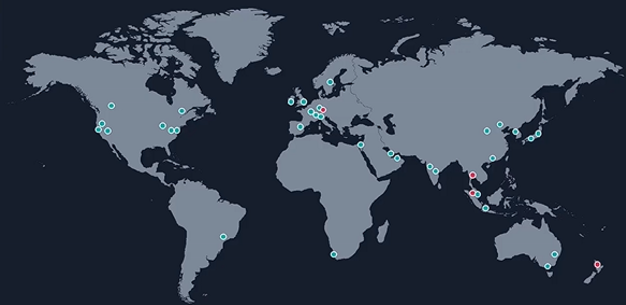

# 🌐 Fundamentos da Nuvem

Este documento apresenta uma visão geral sobre a história da Amazon e da AWS, explorando desde a criação da livraria online até os fundamentos da computação em nuvem. Aqui você encontrará conceitos de infraestrutura, modelos de negócio, tipos de nuvem e os principais serviços oferecidos, com explicações práticas e curiosidades.

---

## 📑 Sumário

- **História da Amazon**
    - Curiosidades
- **História da AWS**
    - Infraestrutura Global
    - Modelo de Negócio
    - Nuvem Pública, Híbrida e Privada
    - Modelos de Computação na Nuvem

---

## 📦 História da Amazon

A Amazon foi fundada pelo Jeff Bezos, estava na moda a criação de sites pela internet e então ele teve uma grande ideia, uma <ins>livraria online!</ins>
Logo, iniciou o projeto de livraria online em 1994. O escritório era em sua garagem, localizada em Seattle, Washington. O site foi lançado oficialmente em 1995!

### 🔹 Curiosidades!

> - O nome inicial da Amazon foi Cadabra. Fazendo uma associação com abracadabra por ter uma magia nos livros!
> - O nome da Amazon foi inspirado no Rio Amazonas, sim esse mesmo. Um dos maiores rios do mundo em extensão e cuja grande parte fica localizada no Brasil! No início, esse nome não pegou muito, os gringos não conheciam muito sobre a nossa cultura, mas o Jeff usou o marketing "Esse rio supera todos os outros de longe" dando a entender que ele superaria tudo e todos!

---

## ☁️ História da AWS

A Amazon começou desenvolvendo soluções de tecnologia para gerenciar seus próprios recursos de computação durante os anos 2000. Percebendo que essas ferramentas internas poderiam ser úteis para outras empresas, a companhia decidiu transformar essa expertise em um serviço comercial. Em 2006, lançou oficialmente a AWS com serviços como o S3 para armazenamento de dados e o EC2 para processamento, criando assim uma plataforma completa de computação em nuvem. O grande diferencial foi o modelo de pagamento por uso, onde os clientes só desembolsam pelo que realmente consomem, o que representou uma inovação importante no mercado da época.

###  ⇨ Infraestrutura Global da AWS

A AWS possui uma rede global de data centers organizados em dois níveis. As *"Regions"* são áreas geográficas que agrupam vários data centers menores. Dentro de cada *Region* existem as *"Availability Zones"*, que são data centers independentes fisicamente, mas que se comunicam entre si de forma integrada. Essa organização permite que a AWS garanta alta disponibilidade dos serviços, já que mesmo que um data center falhe, os outros continuam funcionando normalmente.

   

### ⇨ Modelo de Negócio da AWS

O modelo de negócio baseado em OPEX (despesas operacionais), o que significa que você não precisa investir em uma infraestrutura física pesada antes de começar seu projeto. Isso contrasta com o modelo tradicional CAPEX (despesas de capital), onde as empresas precisam comprar e manter equipamentos caros desde o início.

Na prática, isso funciona através de um sistema de pagamento flexível onde você paga apenas pelos recursos que realmente usa. Se sua aplicação precisa de mais processamento em um determinado mês, você paga mais; se usa menos, paga menos. Não há contratos longos ou investimentos antecipados obrigatórios.

Além disso, a AWS oferece uma ampla gama de serviços para atender diferentes necessidades. Você encontra desde serviços básicos como computação e armazenamento de dados, passando por bancos de dados gerenciados, até soluções mais avançadas e especializadas como machine learning, Internet das Coisas (IoT) e análise de grandes volumes de dados. Essa diversidade permite que empresas de qualquer tamanho encontrem soluções adequadas para seus projetos específicos.

### ⇨ Nuvem Pública, Híbrida e Privada

A nuvem pública é aquela oferecida por provedores como a AWS, onde os recursos são compartilhados entre múltiplos clientes e acessíveis pela internet. É a opção mais econômica e flexível, ideal para empresas que buscam escalabilidade rápida sem grandes investimentos iniciais.

A nuvem privada é uma infraestrutura de computação dedicada exclusivamente a uma única organização. Ela oferece maior controle, segurança e personalização, mas exige investimentos significativos em hardware e manutenção. É comum em empresas com requisitos rigorosos de compliance ou dados sensíveis.

A nuvem híbrida combina o melhor dos dois mundos: integra recursos da nuvem pública com a infraestrutura privada existente. Isso permite que as empresas mantenham dados críticos e sistemas sensíveis na nuvem privada, enquanto aproveitam a escalabilidade e economia da nuvem pública para outras aplicações. É especialmente útil para empresas em transição ou com demandas variáveis de processamento.

### ⇨ Modelos de Computação na Nuvem

Existem três modelos principais de serviços em nuvem: IaaS, PaaS e SaaS. Cada um oferece um nível diferente de controle e responsabilidade para o usuário.

**IaaS (Infrastructure as a Service)** fornece os recursos básicos de infraestrutura como servidores virtuais, armazenamento e redes. O provedor de nuvem cuida da parte física, mas você é responsável por configurar e gerenciar tudo que está em cima disso, incluindo sistemas operacionais, aplicações e dados. É ideal para quando você quer migrar sistemas já existentes ou construir algo do zero.

**Explicação do professor:** Um exemplo prático é uma instância de máquina virtual na AWS.

**PaaS (Platform as a Service)** oferece uma plataforma completa pronta para você desenvolver e executar suas aplicações, com sistemas operacionais, bancos de dados e ferramentas de desenvolvimento já inclusos. O provedor gerencia a infraestrutura e a plataforma, enquanto você se concentra apenas em desenvolver e implantar sua aplicação.

**Explicação do professor:** É como quando você pega um SQL Server já pronto e coloca sua aplicação para rodar nele, sem se preocupar com a manutenção da infraestrutura.

**SaaS (Software as a Service)** disponibiliza softwares prontos para usar direto pela internet, geralmente no navegador, sem precisar instalar nada. O provedor gerencia absolutamente tudo, e você apenas utiliza o serviço pagando uma assinatura.

**Explicação do professor:** Exemplos comuns são e-mail, Netflix, Spotify e sistemas de CRM. Você simplesmente paga pelo uso e não precisa fazer nenhuma manutenção.

### ⇨  Configuração da conta e práticas de segurança

Ao criar uma conta **CLOUD**, a conta principal (**root**) tem permissões administrativas completas para gerenciar o workspace.

### 🔻   Autenticação Multifator (MFA)
A **autenticação multifator (MFA)** é uma camada adicional de segurança para proteger a conta, exigindo mais de uma forma de verificação durante o login.

**Como habilitar a MFA?**  
Ativar a MFA nas configurações de segurança da sua conta. Além disso, é possível criar uma **conta administrativa separada** do usuário root, garantindo maior controle e segurança no gerenciamento do workspace.

### 🔹 Tipos de contas
- **Conta raiz (root):** Tem privilégios absolutos
- **Conta IAM:** Contas com permissões limitadas

🚩 **Posso usar a mesma senha para ambas as contas?**  
O professor não comenta sobre isso, mas, ao pesquisar, não é recomendado usar a mesma senha para a conta IAM e a conta root por questões de segurança. Se alguém descobrir a senha do IAM, pode tentar usá-la na conta root e, se for igual, terá acesso total.

### ⇨ Dicas de boas práticas:
- Nunca reutilize a senha root; crie uma senha única e longa só para root.
- Ative MFA na conta root imediatamente (autenticador de app ou hardware).
- Crie um usuário IAM administrador para o dia a dia e evite usar root.
- Habilite MFA para qualquer usuário com privilégios sensíveis.
- Implemente política de senha para IAM (comprimento mínimo, rotação etc.).
- Use **roles** e credenciais temporárias (STS) para aplicações e integrações.
- Guarde senhas em um gerenciador (LastPass / Bitwarden / 1Password).
- Revogue/apague **access keys** do root e use roles com políticas bem definidas.

### ⇨ Conceitos Fundamentais

O professor apresenta de forma concisa todos os campos do site e explica a função de cada elemento:

[Console Lambda AWS](https://us-east-1.console.aws.amazon.com/lambda/home?region=us-east-1#/functions)

- A **região mais cara** é o Brasil, enquanto o **Norte da Virgínia** é a mais barata; vamos utilizar o Norte da Virgínia.
- O site da AWS é personalizável: cor da tela, idioma, notificações e **CloudShell** (também podemos criar recursos via portal, AWS SDK ou CloudShell).

### ⇨ O que é um IAM - Usuários da conta
- **Console AWS:** Página inicial da AWS com informações gerais
- **Interface CLI:** Permite criar comandos para criar recursos
- **CloudShell:** Alternativa para criar e gerenciar recursos via navegador

**Formas corretas de acessar recursos AWS (pergunta de prova):**
- Console
- CLI
- CloudShell

### ⇨ Acesso ao AWS CLI e Criação de Grupos de Usuários

Os erros que estavam aparecendo eram porque o usuário **ADM** não tinha as permissões corretas.  
Não foi necessário criar uma permissão em JSON, pois a permissão que eu precisava era de **acesso total**, como ADM. Como ela já constava na lista da AWS junto com outras permissões, apliquei-a como permissão direta.  
Os erros foram resolvidos e agora tenho **acesso total à conta ADM**, sem precisar acessar a conta root toda hora.

[Documentação oficial AWS CLI](https://docs.aws.amazon.com/cli/latest/userguide/getting-started-quickstart.html)

O professor diz que precisamos criar uma **chave de acesso para o CLI**, mas não explica detalhadamente. Ele generaliza, dizendo que pode ser qualquer número. Vamos ter um milhão de senhas e ele não esclarece do que se trata.

### ⇨ Para que serve a chave CLI na AWS?
A chave de acesso para o **CLI (Command Line Interface)** serve para autenticar você quando usa a AWS **fora do console web**.  
Ou seja, se você quer usar comandos no terminal para criar recursos, consultar serviços, rodar scripts ou automatizar tarefas, você precisa dessa chave.

### ⇨ Composição da chave
- **Access Key ID** → o “usuário” da chave
- **Secret Access Key** → a “senha” da chave

Sem essas duas, o CLI **não consegue se conectar à sua conta AWS**.

### ⇨ Posso usar a mesma chave de acesso da conta root?
Não é recomendado.
- A **conta root** é a conta principal da AWS, com acesso ilimitado a tudo. Usar essa conta para CLI é perigoso, pois qualquer erro pode afetar toda a conta.
- O ideal é criar um **usuário IAM** com permissões específicas (por exemplo, admin ou apenas S3, EC2, etc.) e gerar a chave de acesso para ele.

**Resumo:**
- CLI = precisa de chave para autenticação
- Root = usar apenas para configurações críticas
- Usuário IAM = gerar chave e trabalhar de forma segura

### ⇨ Comentários sobre a prática
- Criei os grupos e subi a permissão conforme cada setor, além da permissão para alterar a própria senha.
- O professor cria uma pasta com todas as atividades; antes de enviar pelo Git Bash, é necessário ter essa pasta.
- Ao todo, são 20 usuários, e o envio é feito de uma só vez.

### ✅ Conclusão

A Amazon e a AWS transformaram o conceito de computação em nuvem, oferecendo serviços escaláveis, seguros e flexíveis.  
Com infraestrutura global, modelos de negócio inovadores e diferentes tipos de nuvem, é possível aproveitar ao máximo os recursos disponíveis de forma eficiente.

---

> Por [Sinthian Marques ](https://github.com/SinthianMar) | [LinkedIn](https://www.linkedin.com/in/sinthianmarques) | sinthianmarquesjp@gmail.com 

---
