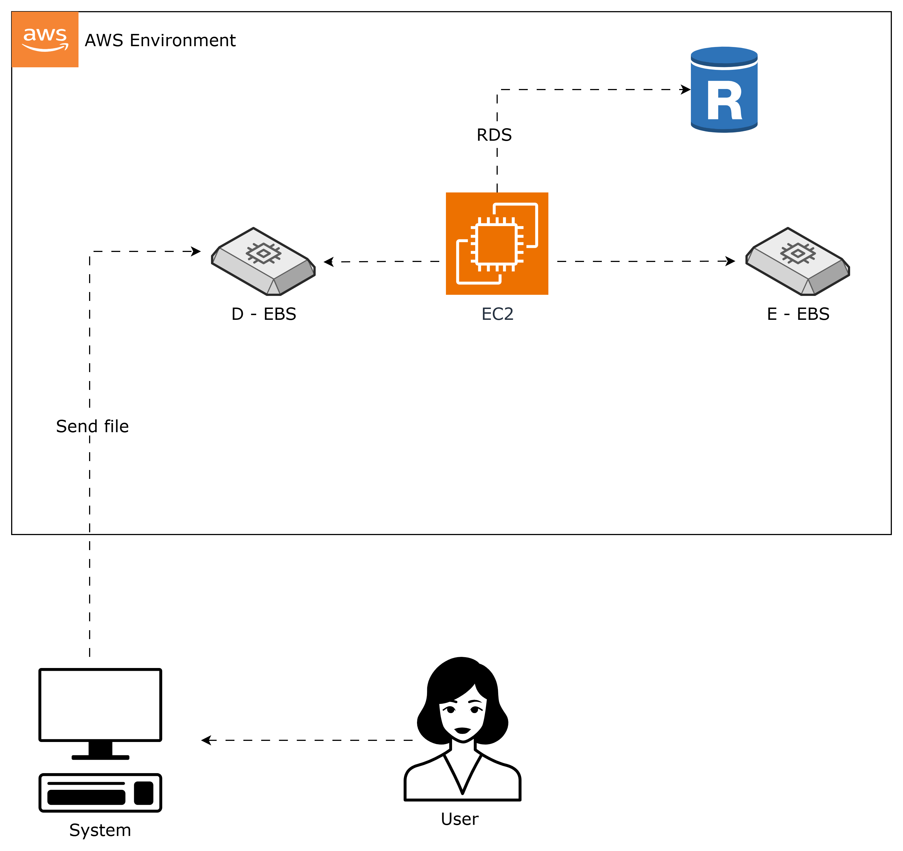
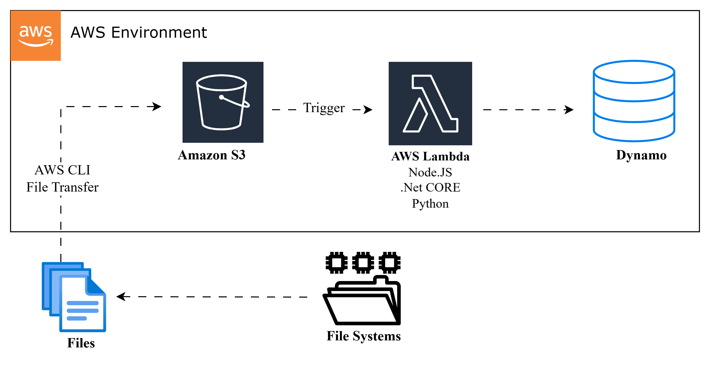
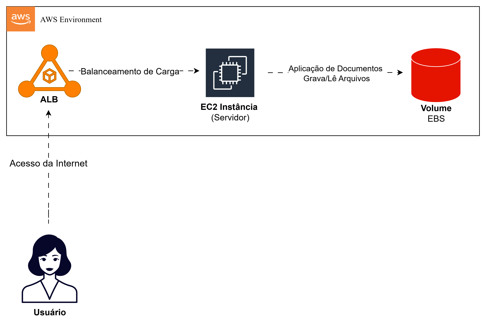
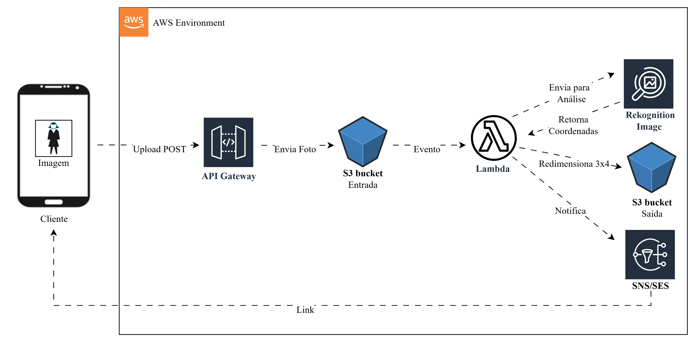

### Code girls - AWS

---

## Gerenciando Instâncias EC2 na AWS

Este documento explora arquiteturas AWS para gerenciamento de arquivos e documentos,
destacando soluções com EC2/EBS para processamento persistente e S3/Lambda para abordagens
serverless, inspiradas em cenários reais como repositórios de bootcamp e redimensionamento de
fotos.

---

## Gerenciando Instâncias EC2 na AWS

### Gerenciamento de arquivos (EC2 + EBS)

Montar um servidor com 2 EBS:

1. Um processa os arquivos
2. Outro deixa disponível pra acessar

**Como funciona:**
O usuário entra no sistema e manda o arquivo pra nuvem (EBS). O EC2 pega esse arquivo, processa, valida,
consulta no banco... Depois o EBS fica com os documentos disponíveis para quando precisar acessar.

  

---

### Gerenciamento de arquivos (S3 + Lambda)

**Como funciona:**
O sistema de arquivos manda o arquivo para o S3 usando linha de comando ou transfer file. Depois o
Lambda pega esse arquivo, processa e joga no banco de dados.

  

---

### Desafio drawio

#### 1 - Diagrama: Repositório de Documentos do Bootcamp (EC2 + EBS)

O EC2 permite controle total sobre máquinas virtuais e o EBS é tipo um HD virtual. Foi daí que veio
a ideia, claro que o uso dos dois é para grande escala, mas pensei numa arquitetura onde o sistema
gerencia os documentos de estudo do bootcamp e guarda esses dados.

**Como funciona:**

1. Usuário/Aluno - A pessoa acessa o sistema pela internet para enviar ou consultar
   documentos de estudo
2. ALB (Application Load Balancer) - Recebe as requisições e distribui o tráfego entre as
   instâncias EC2 disponíveis
3. Auto Scaling Group - Gerencia a infraestrutura das instâncias EC2, controlando quantas
   estão ativas e saudáveis
4. Instância EC2 - É o "coração" da aplicação, executa o sistema que:
   ○ Recebe a requisição do ALB
   ○ Processa os documentos (upload, validação, organização)
   ○ Acessa o volume EBS para gravar novos arquivos
   ○ Lê arquivos já armazenados quando o usuário solicita
   ○ Retorna a resposta para o usuário
5. Amazon EBS - Funciona como HD virtual permanente, armazenando todos os documentos
   de estudo do bootcamp de forma persistente

  

---

#### 2 - Diagrama: Foto 3x4 Serverless (S3 + Lambda)

O Lambda é conhecido popularmente pelo processamento de imagens. Então estive pensando: recentemente
tirei meu documento de identificação e me veio a ideia e se tivéssemos um sistema que redimensiona
automaticamente a imagem para o formato 3x4? Foi assim que surgiu a ideia para esse diagrama.

**Como funciona:**

1. Cliente - A pessoa envia a foto via POST através da API
2. API Gateway - Recebe a requisição e funciona como porta de entrada
3. S3 Entrada - Armazena a foto original enviada
4. Lambda - É o "coração" da aplicação, orquestra todo o processo:
   ○ Pega a foto do S3 Entrada
   ○ Envia para o Rekognition analisar o rosto
   ○ Recebe as coordenadas do rosto
   ○ Redimensiona e corta a foto para o formato 3x4 (padrão de documento)
   ○ Salva no S3 Saída
   ○ Envia notificação via SNS
5. Rekognition - Usa IA para detectar o rosto e fornecer as coordenadas
6. S3 Saída - Armazena a foto final em formato 3x4
7. SNS/SES - Envia email/SMS para o cliente com um link para baixar a foto processada

  

---

### Conclusão

As arquiteturas AWS com EC2/EBS e S3/Lambda oferecem escalabilidade, automação e eficiência para
gerenciamento de arquivos, ideais para processamento persistente ou serverless em escala.

---

### Referências

- Amazon EC2: https://docs.aws.amazon.com/AWSEC2/latest/UserGuide/concepts.html
- Amazon EBS: https://docs.aws.amazon.com/AWSEC2/latest/UserGuide/AmazonEBS.html
- Amazon S3: https://docs.aws.amazon.com/AmazonS3/latest/userguide/Welcome.html
- AWS Lambda: https://docs.aws.amazon.com/lambda/latest/dg/welcome.html

---
