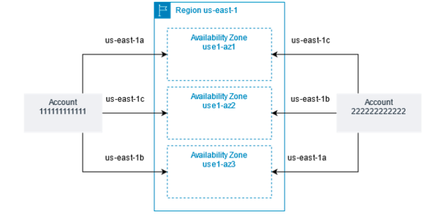

### Code girls - AWS

---

## 2. Fundamentos Essenciais da Infraestrutura AWS

A AWS não é só um computador flutuando na internet. Ela tem uma infraestrutura gigante e
organizada em todo o mundo. Você precisa entender como funciona para escolher onde colocar
seus aplicativos.

---

### Sumário

- Regiões (Regions)
- Zonas de Disponibilidade (Availability Zones - AZ)
- Como Escolher uma Região?
- Serviços Gerenciados da AWS
- Questões
- Conclusão
- Referências

---

### Regiões (Regions)

Uma Region é um local do mundo onde a AWS tem estrutura montada.Pense assim:

- New York = 1 Região
- São Paulo = 1 Região
- Tóquio = 1 Região

A AWS tem mais de 30 regiões espalhadas pelo mundo!

#### Por que existem múltiplas regiões?

- Reduzir latência (dados mais perto do usuário = internet mais rápida)
- Obedecer leis locais (dados brasileiros precisam ficar no Brasil)
- Backup (se um região cair, você tem dados em outro lugar)

---

### Zonas de Disponibilidade (Availability Zones - AZ)

Dentro de cada Região, existem Zonas de Disponibilidade. São data centers diferentes, mas
próximos um do outro.

  

**Exemplo prático:**

- Região São Paulo tem 3 Zonas de Disponibilidade:
  - Zone A
  - Zone B
  - Zone C

**Características:**

- Ficam perto uma da outra (até 100km de distância)
- Mas têm energia, internet e tudo independente
- Se um data center cai, os outros continuam funcionando

#### Por que múltiplas Zonas?

Imagine que um raio cai no data center A e derruba tudo. Se você só usava o data center A, seu site
cai. Mas se você usa A e B ao mesmo tempo, o site continua funcionando com o B!
A AWS opera mais de 100 Zonas de Disponibilidade no mundo inteiro.

  

### Como Escolher uma Região?

Existem 4 fatores principais:

#### 1. Compliance (Leis locais)

Certos dados precisam ficar em certos lugares por lei.
Exemplo: Se você é um hospital brasileiro, dados de pacientes precisam ficar no Brasil (LGPD - Lei
Geral de Proteção de Dados).
Errado: Guardar dados de pacientes na região dos EUA
Certo: Guardar na região São Paulo

#### 2. Disponibilidade de Serviços

Nem todo serviço da AWS funciona em todas as regiões!
Exemplo: Um serviço novo pode estar disponível nos EUA, mas ainda não no Brasil.
Errado: Decidir usar um serviço que não existe em São Paulo
Certo: Conferir antes se o serviço existe na região que você quer

#### 3. Latência (Velocidade)

Quanto mais perto do seu usuário, mais rápida a internet.Exemplo:

- Usuário em São Paulo → usar Região São Paulo (rápido!)
- Usuário em São Paulo → usar Região Tóquio (lento!)

Latência alta = site lento. Latência baixa = site rápido.

#### 4. Custo

O preço varia por região!
A região mais barata: Norte da Virgínia (EUA)
A região mais cara: Brasil
Informação prática: Se você está desenvolvendo um projeto e quer economizar, pode usar Norte da
Virgínia. Depois, quando for produção, move para a região mais apropriada.

---

### Serviços Gerenciados da AWS

O que é? São serviços que a AWS gerencia para você. Você não se preocupa com a infraestrutura
por baixo.

**Exemplos:**  

| Serviço | O que faz                                           |
| -------- | --------------------------------------------------- |
| RDS      | Banco de dados gerenciado (MySQL, PostgreSQL, etc.) |
| EKS      | Container orquestration (tipo Docker)               |
| Lambda   | Rodar código sem precisar de servidor              |

**Benefícios:**

- Você não precisa mexer em infraestrutura
- Escalabilidade automática
- AWS cuida de atualizações e manutenção
- Mais tempo para programar, menos tempo para gerenciar

Exemplo uso real: E-commerce, streaming de vídeos, análise de dados gigantes.

---

### Questões:

1. O que é uma Região na AWS?

   - [ ]  Um data center
   - [X]  Uma área geográfica com múltiplas Zonas de Disponibilidade
   - [ ]  Um computador
   - [ ]  Uma máquina virtual
2. Qual é a distância máxima entre Zonas de Disponibilidade?

   - [ ]  10 km
   - [ ]  50 km
   - [X]  100 km (60 milhas)
   - [ ]  500 km
3. Se um data center cai, o que acontece?

   - [ ]  Seu site inteiro cai
   - [X]  Outros data centers na mesma zona continuam servindo
   - [ ]  Você não consegue mais usar AWS
   - [ ]  Tudo cai no mundo inteiro
4. Qual fator NÃO é importante ao escolher uma Região?

   - [ ]  Compliance legal
   - [ ]  Latência para usuários
   - [X]  A cor do mapa da região
   - [ ]  Custo da região
5. A região São Paulo é mais barata ou mais cara que Norte da Virgínia?

   - [ ]  Mesma preço
   - [X]  São Paulo é mais cara
   - [ ]  Norte da Virgínia é mais cara
   - [ ]  Não tem preço

---

### Conclusão

A AWS é global, mas você precisa pensar localmente. Escolher a Região certa significa considerar
onde estão seus usuários, onde os dados precisam ficar por lei, e quanto você quer gastar. As
Zonas de Disponibilidade garantem que seu site continue funcionando mesmo se uma cair.

---

### Referências

- Mapa interativo de Regiões: [https://aws.amazon.com/about-aws/global-infrastructure/](https://aws.amazon.com/about-aws/global-infrastructure/)
- Documentação Regiões:
  [https://docs.aws.amazon.com/general/latest/gr/aws-service-information.html](https://docs.aws.amazon.com/general/latest/gr/aws-service-information.html)

Documento: [fundamentos-essenciais-da-infraestrutura-aws.pdf](../materiais-de-apoio/fundamentos-essenciais-da-infraestrutura-aws.pdf)
